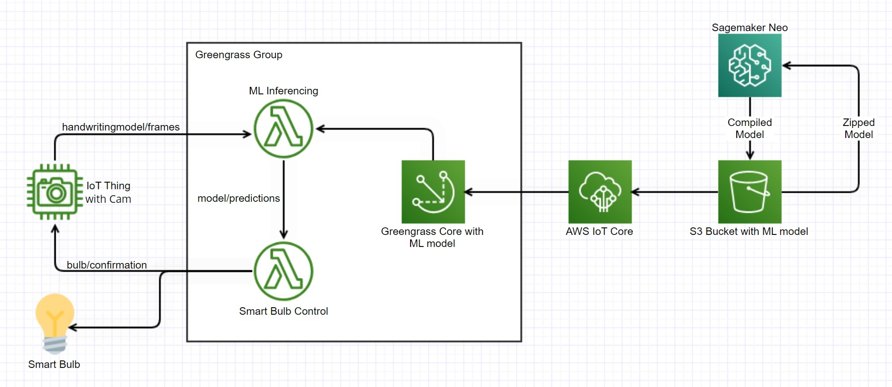

# Controlling Smart Bulb Using GreenGrass Core And ML
This projects allow someone to control a Yeelight smartbulb from their own handwritten commands. An IoT thing takes picture of handwritten command and send it to greengrass group where a ML model predicts the word from that handwritten command and sends that command to smart bulb. Implementation and usage of this project is explained [here](https://anubhavjhalani.medium.com/controlling-smart-bulb-using-greengrass-core-and-ml-c284fc922ed5#19a1).

# Work Flow

# Resources Used
1. **Windows PC** - As IoT thing with cam
2. **Linux PC** - As greengrass core device
3. **AWS IoT Core** - To deploy greengrass group on greengrass core device
4. **AWS Sagemaker Neo** - To compile Keras model
5. **S3 Bucket** - To save ML model
6. **AWS Lambda** - For processing and inferencing

# Directories
1. **extracting-my-handwriting-and-train-model** :  contains python code which extract handwritten characters from an image to create dataset to train model.
2. **pyimagsearch/az_dataset** : contains python code to read the dataset for training.
3. **pyimagsearch/models** : contains resnet model which is used for transfer learning.
4. **lambda functions** : contains lambda functions and greengrasssdk to be deployed on greengrass core.
